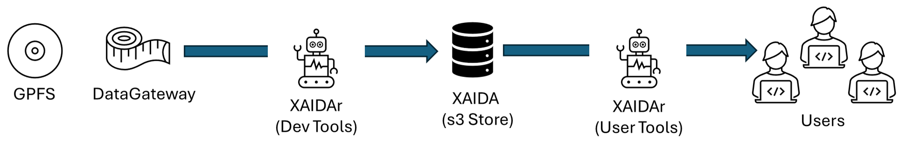
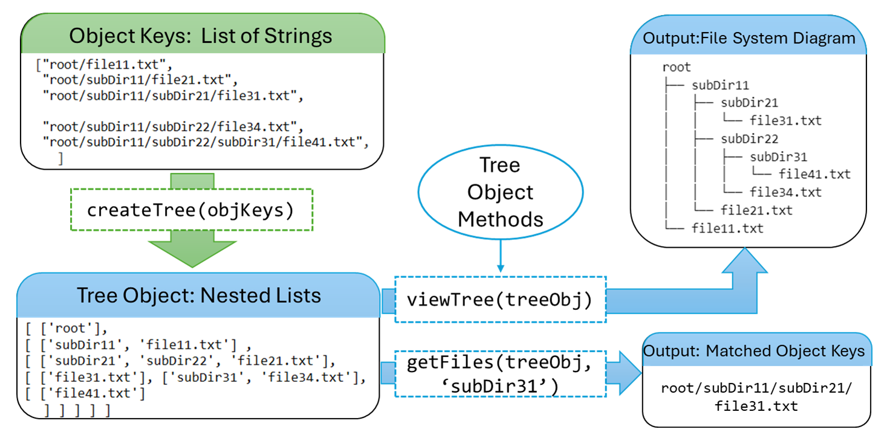

# 
XAIDAr: XChem AI Data Archiver 

## Intro

The goal of the project is to develop a data archive off of the XChem data for AI and ML purposes (XAIDA). All computational tools required to achieve this purpose are found here as part of XAIDAr. These tools aid extracting, manipulating and filtering XChem data, and device tools to pull and push the data from and into object store.

    

## Repo Structure

<strong> xaidar</strong>: Contains all the scripts.

- `s3Utils.py`: Python wrapper around boto3 to aid interaction with object store.
- `treeObj.py`: Python code to instantiate the treeObj base pythonic data structure.
- `treeObjUtils.py`: Tools to load and save a treeObj instance, and view it.
- `treeObjExtract.py`: Advanced tools to filter and identify object keys of interest.
- `sqliteUtils.py`: Tools to extract wanted information from soakDatabase.sqlite files.
- `gatewayApi.py`: Tools to interact with the API.

<strong> data</strong>: Directory where all data files live.

- `s3Data`: Contains the data extracted from the S3 Object Store.
- `s3ObjKeys`: Contains python pickle files, each corresponding to a subset of all Object Keys Found in Object Store, as a list of strings python object.
- `treeObjs`: Contains python pickle files, each representing the file system structure native to the object keys, in the form of a list of lists python objects.

<strong> notebooks</strong>: Contains Jupyter Notebooks with interactive code implemenations and demos.

- `tasks`: Contains jupyter notebooks which implement some of the functions in an interactive way.
- `scripts`: Contains jupyter notebooks which explain the development of each different python script.
- `demos`: Contains small demos on how to use the scripts.

<strong> tests</strong>: Contains small datasets useful to test some of the code found within scripts.

- `testFileSys.py` - Toy example of Object Store Keys.

## Current S3 Object Store Structure

### Buckets
***xchem***
- It contains 2 main root directories:
    - `dataset` 
        - It seems to be associated with processing the data afterwards
        - There is no PanDDa data included in this directory.
    - `data` 
        - Original data. 
        - There are two main project structures: 
            - *\<year>-\<sessionID-subsessionjID>* 
            - *\<sessionID>-\<subsessionjID>*
        - Each project contains PanDDa data.
            
***pandda***
- It does not contain a root. The supraroot contains a list of files - describing records and log files - and each folder represents a specific project.
- This PanDDA Bucket seems to be associated with the XChem bucket - dataset directory.

### Data Statistics

<strong> Overall </strong>
| Number Of Sessions | Number of Years | Number of Object Keys | 
| :----: |:---: | :---: |  
| 738 | 9 (2015-23) | 129 302 508 |  

<strong> Per Year </strong> 

| Years | Number Of Sessions | Number of Object Keys | 
| :----: |:---: | :---: |
| 2015 | 18 | 24 732 821  |
| 2016 | 72 | 32 432 198 |
| 2017 | 159 |  25 736 567 |
| 2018 | 135 | 15 224 629 |
| 2019 | 111 | 6 401 530 |
| 2020 | 122 | 12 278 697 |
| 2021 | 83 | 10 561 631 |
| 2022 | 9 | 416 678 |
| ?2023? | 29 | 1 517 757 |

## Code Logic

### Intro
- Uses boto3 python package to interact with S3 store, with a simple wrapper to facilitate usage (`S3Utils.py`).
- Converts the object keys into a list of lists - as a base pythonic data structure - and creates a set of tools to manipulate and filter the data in said data structure (`objFileSys.py`).

### Goals
- Retrieve and import data from and into S3 store.
- Browse through the inherited file structure associated with the object keys. Provide an interactive experience for interacting with the object store.
- Create tools to easily obtain the wanted object keys.

### Implementation
- Downloaded all object keys locally, divided them into lists of strings for each project session, and saved them locally as python pickle objects.
- Converted each list of strings into a list of lists - base pythonic data structure.
- Created several tools to browse and extract data.

    

## Installing Required Dependencies
UV has been used during the development of this repo. 
Python version used was 3.11.5.